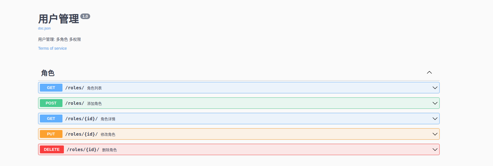

# Gin Example 
持续更新  
这是基于Go Gin封装的Web框架。只需要修改[internal](https://github.com/destinysz/gin_example/tree/master/internal) 处逻辑代码，实现快速开发。  


## 主要功能：
- 日志功能: 异常日志、数据库日志 (zap + lumberjack)
- 配置管理: 根据不同环境变量加载不同的配置 (viper)
- msyql操作: 逻辑删除、修改自动更新时间、统一分页处理 (gorm)
- 参数验证: 中文翻译 (validator/v10)
- 统一异常处理: 自定义业务异常、中间件全局捕获
- 接口文档: swagger
- docker构建部署


## 目录说明
```
├── common                 # 通用模块
├── config                 # 配置文件
├── docker                 # 构建脚本
├── docs                   # 文档
│   ├── sql                # 建表ddl
│   └── swagger            # swagger生成目录
├── global                 # 全局变量
├── go.mod 
├── go.sum
├── init                   # 项目初始化
├── internal               # 内部模块
│   ├── controller         # 路由方法
│   ├── model              # 数据库模型
│   ├── router             # 路由
│   └── service            # 业务逻辑
├── logs                   # 日志存放
├── Dockerfile             # Dockerfile
├── main.go
├── README.md
```


## 使用项目
### 默认已经装好go
```
go env -w GO111MODULE=on
go env -w GOPROXY=https://goproxy.io,direct
```

### 安装包
```
git clone 
go mod download
go install  github.com/swaggo/swag/cmd/swag
swag init --output ./docs/swagger/
```

### 在数据库执行 sql
[001_init.sql](docs/sql/001_init.sql)

### 根据自己环境修改配置
[config](https://github.com/destinysz/gin_example/tree/master/config)

### 执行并访问swagger
```
go run main.go
```
http://xxxx/swagger/index.html


## Demo
该项目使用一个用户管理为例子。目前实现的是role角色的单表crud。




## Features
- mysql、事务
- mysql外键相关业务demo
- 封装优化gorm查询，目前模糊搜索只能10个字段过滤使用10个if来进行(目前在demo中只通过stuct实现了精确搜索)
- redis操作
- 优雅重启/停止
- 链路追踪


## 问题
1. validator翻译error  
出现情况： 对于 name字段`binding:"omitempty,min=1,max=30"`输入 ""。   
若min=2 输入 "a" 则能正确翻译

2.


## gorm使用注意点: 

### sql注入

127.0.0.1:9001/roles/100 or 1=1/   

以下存在sql注入  
```
db.Model(Role{}).First(&role, c.Param("id"))    
db.Model(model.Role{}).Where(fmt.Sprintf("id = %s", c.Param("id"))).First(&role)
```

以下方式不会，虽然logger打印的SQL像存在注入，但是实际执行已被转义
```
db.Model(model.Role{}).Where("id = ?", c.Param("id")).First(&role)
db.Model(model.Role{}).First(&role, "id = ?", c.Param("id"))
```

### gorm会自动过滤结构体零值，导致更新不成功
这是因为使用stuct类型对象作为参数时，struct会首先转化为map对象，然后再生成SQL语句，但是转化为map的过程中，对于零值字段是忽略的。  
结构体使用指针类型来避免